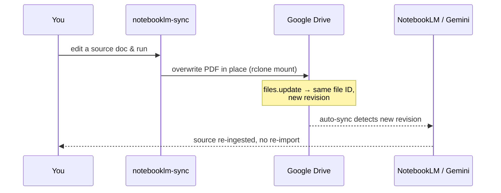
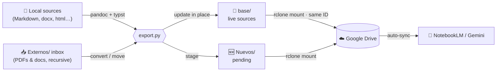

<div align="center">

# 📚 notebooklm-sync

### Keep your **NotebookLM** knowledge base in sync with **Google Drive** — automatically.

<p>
  <a href="../../LICENSE"></a>
  
  
</p>

<p><b>⚡ PLUGS INTO</b></p>
<p>
  
  
  
  
</p>

<p><b>🛠️ BUILT WITH</b></p>
<p>
  
  
  
</p>

Convert your local docs (Markdown, Word, HTML…) and a drop-in inbox into **PDFs** on a
Drive folder mounted with **rclone**, overwriting them *in place* so **Drive keeps each file's ID**
— which is exactly what makes **NotebookLM (Gemini) auto-sync** re-ingest the new content without
re-importing anything.

</div>

---

## ✨ What it does

`notebooklm-sync` is a small, deterministic tool that maintains a **Google Drive knowledge base
for NotebookLM**. Point it at your documents and an inbox folder, and it will:

- 🔄 **Convert** Markdown / `.docx` / `.html` / `.txt` / … → **PDF** with `pandoc` + `typst`.
- 📌 **Update in place** the PDFs already imported into NotebookLM, **preserving the Google Drive
  file ID** → NotebookLM's Drive auto-sync refreshes them for you. No re-import, no duplicates.
- 📥 **Process an `Externos/` inbox** (recursively): anything you drop there is converted, renamed
  and staged for review — including files inside subfolders.
- 🧠 **Classify the inbox by content** (optional Claude step): magazines, articles, reports, notes…
  get clean, descriptive filenames.
- 🧾 **Track everything** with a content-hash manifest, so only what actually changed is reconverted.

> **TL;DR** — Edit your docs → run one command → your NotebookLM notebook is up to date.

---

## 🧠 Why this exists (the Drive + NotebookLM + Gemini trick)

NotebookLM can import sources from **Google Drive**, and it will **auto-update** a source when the
underlying Drive file changes — **as long as the file keeps the same Drive ID.** Most "sync" tools
break this: they save by writing a temp file and renaming over the target, which on Drive becomes
*delete + create* → **a brand-new file ID** → NotebookLM keeps pointing at the old, stale file.

`notebooklm-sync` writes by **truncating and rewriting the existing file in place** through an
`rclone mount`, which maps to a Drive `files.update` → **same ID, new revision.** That single detail
is the whole point, and it's verified end to end.



---

## 🗂️ The three-folder model

Everything lives under one Drive `base` folder:

```
base/                         ← live sources, already added to NotebookLM
│                               (the script UPDATES these in place → same Drive ID)
├── Nuevos/                   ← pending additions: new sources + processed inbox files
│   └── _INDICE.md              (you add these to NotebookLM by hand, then move them up)
└── Externos/                 ← INBOX: drop external files here (recursive)
    └── _originales/            (originals of converted non-PDF files are archived here)
```



| Folder | Role | Who writes |
| --- | --- | --- |
| **`base/`** | Sources already in NotebookLM. Updated **in place** → Drive keeps the ID → auto-sync. | tool + you |
| **`base/Nuevos/`** | Pending additions. You add them to NotebookLM and move them up. Never auto-emptied. | tool → you |
| **`base/Externos/`** | Drop-in inbox (recursive). Files are converted, renamed and staged in `Nuevos/`. | you → tool |

---

## 🚀 Quick start

### 1. Requirements

| Tool | Why | Install (Arch/CachyOS) |
| --- | --- | --- |
| [`pandoc`](https://pandoc.org) | document → PDF | `sudo pacman -S pandoc` (or `pandoc-bin`) |
| [`typst`](https://typst.app) | the PDF engine | `sudo pacman -S typst` |
| [`rclone`](https://rclone.org) | mount Google Drive | `sudo pacman -S rclone` |
| `poppler` *(optional)* | classify inbox PDFs | `sudo pacman -S poppler` |

### 2. Mount your Drive with rclone

```bash
rclone config            # create a "gdrive" remote (Google Drive, scope: drive)
rclone mount gdrive: ~/gdrive --vfs-cache-mode writes --dir-cache-time 1m --vfs-write-back 2s
```

> ⚠️ `--vfs-cache-mode writes` is **required** to modify existing files in place. Run the mount as
> a systemd **user** service so it survives reboots. **Never commit `rclone.conf`** — it holds your
> OAuth token.

### 3. Configure

Copy `notebooklm-sync.config.example.json` → `notebooklm-sync.config.json` and edit it:

```jsonc
{
  "base": "~/gdrive/NotebookLM",          // your mounted Drive folder
  "root": ".",                            // where source globs resolve
  "sources": [
    { "glob": "docs/**/*.md", "label": "", "title": "h1" }
  ]
}
```

### 4. Run

```bash
python3 export.py --dry-run     # preview the plan, change nothing
python3 export.py               # convert + sync
python3 export.py --force       # reconvert everything (ignore the hash)
```

That's it. New sources land in `Nuevos/`; add them to NotebookLM once and move them into `base/`.
From then on, every run **updates them in place** and NotebookLM auto-syncs the changes.

---

## ⚙️ Configuration reference

Everything is optional except `base` and at least one `sources` rule (or just use the inbox).

| Key | Default | What it controls |
| --- | --- | --- |
| `base` | — | **(required)** mounted Drive folder. Must be **outside** `root`. |
| `root` | config dir | Where `sources` globs resolve. |
| `sources[]` | `[]` | Rules in order: `glob` (`**` supported), `label` (filename prefix), `title` (`h1`\|`filename`), `priority` (free metadata). |
| **`layout`** | | **Directory hierarchy** |
| `layout.nuevos` / `externos` / `originales` | `Nuevos` / `Externos` / `_originales` | Folder names. |
| `layout.manifest` / `indexFile` | `.notebooklm-sync.json` / `_INDICE.md` | State + index filenames. |
| `layout.preserveSubdirs` | `false` | Keep the inbox's subfolder structure inside `Nuevos/` (vs flatten). |
| **`conversion`** | | **Output format & rendering** |
| `conversion.outputExtension` | `.pdf` | Output extension. |
| `conversion.pdfEngine` | `typst` | pandoc PDF engine (used when output is `.pdf`). |
| `conversion.header` | `pandoc-header.typ` | typst header (makes wide tables page-breakable). `null` to disable. |
| `conversion.extraArgs` | `[]` | Extra args passed to `pandoc`. |
| `conversion.formatOverrides` | `{}` | Override the extension → pandoc-format map. |
| **`files`** | | **Inbox file handling** |
| `files.externosPdf` | `move` | `move` or `copy` inbox PDFs into `Nuevos/`. |
| `files.archiveOriginals` | `true` | Archive converted non-PDF originals in `_originales/`. |
| `files.deleteEmptySubdirs` | `true` | Delete inbox subfolders once emptied. |
| `files.convertExtensions` | `null` | Restrict which extensions convert (`null` = all supported). |
| **`classification`** | | **Assistant (Claude) behavior — see below** |
| `classification.enabled` | `true` | Whether the assistant reclassifies the inbox. |
| `classification.language` | `es` | Output language for titles. |
| `classification.categories` | `[Revista, Artículo, Informe, Apuntes, Documento]` | Allowed categories. |
| `classification.nameTemplate` | `Externo - {categoria} - {titulo}.pdf` | Final filename template. |
| `classification.relevanceField` | `relevante` | Manifest field for relevance tagging. |
| `classification.priorityBuckets` | `[]` | **Priority classification** buckets (e.g. `["core","tangential"]`). |
| `classification.lowConfidence` | `flag` | `flag` or `skip` low-confidence items. |
| `classification.extraInstructions` | `""` | Free-text guidance for the assistant. |

---

## 🤖 The classification step (with Claude)

The script renames inbox files **mechanically** (de-kebabized filename) because a script can't read
meaning. The **fine-grained classification is done by an assistant** (Claude) per your
`classification` config: it reads the first pages of each inbox PDF (`pdftotext` / `pdfinfo`),
assigns a category and a clean title, renames to your `nameTemplate`, updates the manifest and
regenerates the index. Run the tool without an assistant (e.g. in CI) and files just keep the
provisional name — still correct, just less polished.

### 👋 Welcome prompt for Claude

Paste this into Claude (Claude Code) to onboard it to the skill:

```text
You have the notebooklm-sync skill. I keep my NotebookLM sources in a Google Drive
folder mounted with rclone (see notebooklm-sync.config.json → base).

When I say "sync NotebookLM" or tell you I dropped files in Externos/:
1. Run a dry run first:   python3 export.py --dry-run
   Review the plan with me, then run for real:   python3 export.py
2. For each new "Externo - *" file in Nuevos/, read its content
   (pdftotext -f 1 -l 3 "<file>" -; fall back to pdfinfo + filename if scanned),
   then rename it following classification.nameTemplate and the categories /
   priorityBuckets in my config. Update the manifest keys and regenerate _INDICE.md.
3. Report: what changed in base/ (auto-syncs), what's pending in Nuevos/ (I add to
   NotebookLM by hand — there is no API), and anything off-topic or low-confidence.

Never push secrets. The rclone config holds an OAuth token — never commit it.
Writes must be in-place (overwrite the existing file) to preserve the Drive ID.
```

---

## 🔍 How it fits Drive + Gemini + NotebookLM

<p align="center">
  
  ➜
  
  ➜
  
  ➜
  
</p>

- **Google Drive** is the transport: a single mounted folder is your whole NotebookLM source set.
- **NotebookLM** (powered by **Gemini**) imports those PDFs and **auto-syncs** them when their Drive
  revision changes — this tool makes that revision change *in place*, so your AI notebook always
  reflects your latest docs.
- Works for any knowledge base you feed to Gemini/NotebookLM: engineering docs, ADRs, research,
  market reports, study notes, a company wiki exported to Markdown — anything `pandoc` can read.

**Keywords:** NotebookLM Google Drive sync · rclone NotebookLM · keep NotebookLM sources updated ·
Markdown to PDF for NotebookLM · Gemini knowledge base from Drive · auto-update NotebookLM sources ·
preserve Google Drive file ID · pandoc typst PDF.

---

## ❓ FAQ & edge cases

- **Does it touch my source files?** No. It's **read-only** on your sources; it only writes to the
  Drive `base` folder.
- **Duplicate filenames in a Drive folder.** An rclone mount collapses Drive duplicates (it shows
  one); the other is left orphaned — run `rclone dedupe` to clean up.
- **A file I can't delete (`Error 403`).** Files **shared from another account** can't be removed
  via rclone. The tool leaves and reports such inbox subfolders instead of failing.
- **Adding / removing sources in NotebookLM is manual** — there is no public API. The tool prepares
  the files; you do the one-click add and the source removal.

---

## 📄 License

[MIT](../../LICENSE) © Marc Vallverdú
